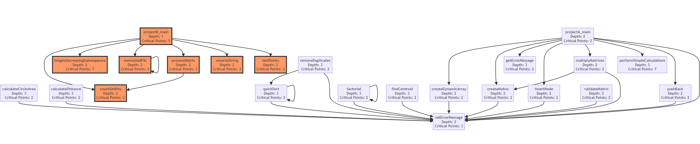
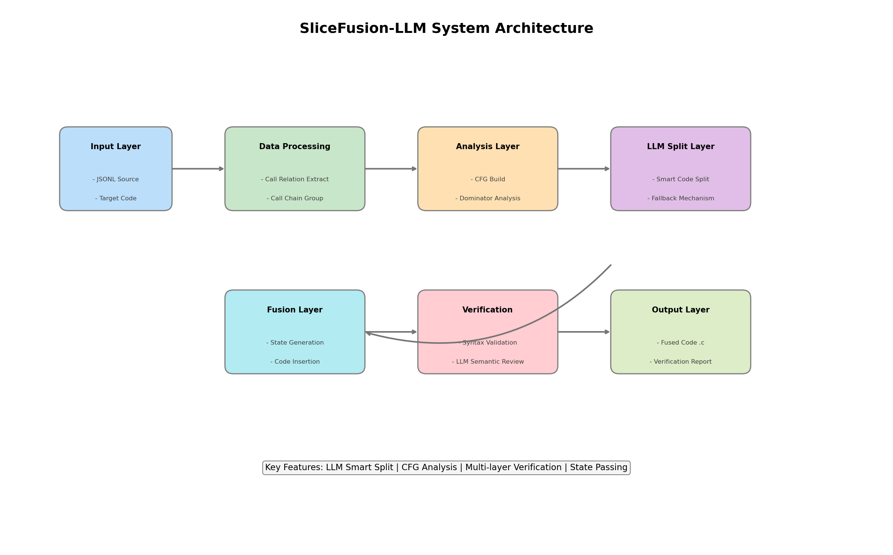
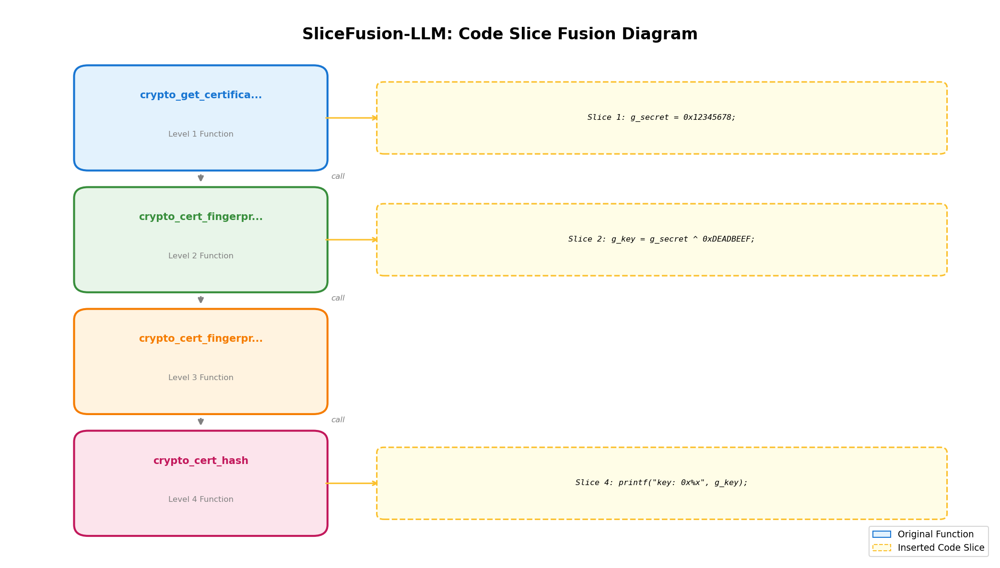
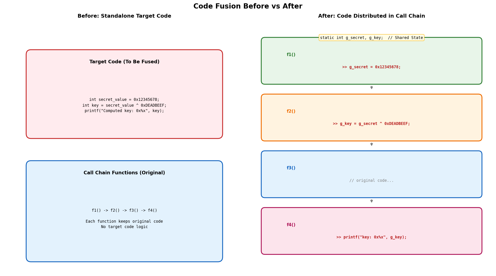
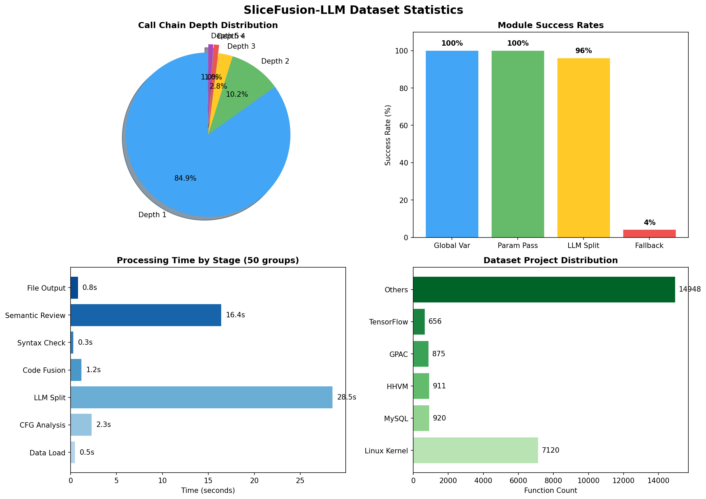
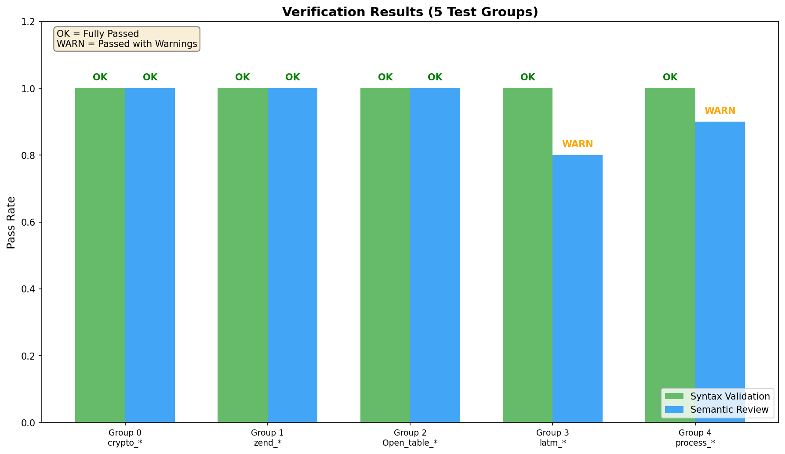

<p align="center">
  
</p>

<h1 align="center">SliceFusion-LLM</h1>

<p align="center">
  <strong>基于函数调用链的智能代码分片融合技术</strong>
</p>

<p align="center">
  <a href="#特性">特性</a> •
  <a href="#快速开始">快速开始</a> •
  <a href="#使用示例">使用示例</a> •
  <a href="#技术架构">架构</a> •
  <a href="#文档">文档</a>
</p>

<p align="center">
  
  
  
  
</p>

---

## 概述

**SliceFusion-LLM** 是一个智能代码融合工具，能够将目标代码片段智能地拆分并嵌入到已有程序的多个函数调用链中。该技术融合了程序分析、编译原理和大语言模型（LLM）三大领域的方法论。

### 核心思路

```
目标代码 → [LLM智能拆分] → 代码片段序列 → [融合到调用链] → 混淆后代码
     │                                              │
     └──────── 语义等价性验证 ◄─────────────────────┘
```

## 特性

- **智能代码拆分** - 利用 LLM 进行语义感知的代码分片，自动处理变量依赖
- **控制流分析** - 构建 CFG，计算支配关系，精确定位融合点
- **多种传递方式** - 支持全局变量和参数传递两种跨函数状态共享机制
- **多层验证机制** - 语法结构验证 + LLM 语义审查，确保融合正确性
- **Fallback 机制** - LLM 失败时自动切换到启发式拆分

## 快速开始

### 环境配置

```bash
# 克隆仓库
git clone https://github.com/yourusername/SliceFusion-LLM.git
cd SliceFusion-LLM

# 创建虚拟环境
conda create -n slicefusion python=3.10
conda activate slicefusion

# 安装依赖
pip install -r src/requirements.txt

# 配置 API Key
export DASHSCOPE_API_KEY="your-api-key-here"
```

### 基本使用

```bash
# 1. 数据预处理 - 提取调用关系
python utils/data_process/extract_call_relations.py \
    --input data/primevul_valid.jsonl \
    --output output/primevul_valid_grouped.json

# 2. 按调用深度筛选（深度≥4的调用链）
python utils/data_process/filter_by_call_depth.py \
    --input output/primevul_valid_grouped.json \
    --depth 4

# 3. 执行代码融合
python src/main.py \
    --input output/primevul_valid_grouped_depth_4.json \
    --output output/fusion_results.json \
    --target-code "int secret = 42; int key = secret ^ 0xABCD; printf(\"key=%d\", key);" \
    --method global \
    --max-groups 5
```

## 使用示例

### 示例 1：基本代码融合（全局变量法）

```bash
python src/main.py \
    --input output/primevul_valid_grouped_depth_4.json \
    --target-code "int secret_value = 0x12345678; int key = secret_value ^ 0xDEADBEEF; printf(\"Computed key: 0x%x\n\", key);" \
    --method global \
    --max-groups 3
```

**融合效果**：目标代码被拆分到 3 个函数中执行

```
┌─────────────────────────────────────────────────────────────────┐
│  f1() [入口函数]                                                 │
│  ┌───────────────────────────────────────────┐                  │
│  │ g_secret_value = 0x12345678;  ← 片段1     │                  │
│  └───────────────────────────────────────────┘                  │
│  ...原始代码...                                                  │
│  call f2() ──────────────────────────────────────────┐          │
└──────────────────────────────────────────────────────│──────────┘
                                                       ▼
┌─────────────────────────────────────────────────────────────────┐
│  f2() [中间函数]                                                 │
│  ┌───────────────────────────────────────────┐                  │
│  │ g_key = g_secret_value ^ 0xDEADBEEF; ← 片段2│                 │
│  └───────────────────────────────────────────┘                  │
│  ...原始代码...                                                  │
│  call f3() ──────────────────────────────────────────┐          │
└──────────────────────────────────────────────────────│──────────┘
                                                       ▼
┌─────────────────────────────────────────────────────────────────┐
│  f3() [末端函数]                                                 │
│  ┌───────────────────────────────────────────┐                  │
│  │ printf("Computed key: 0x%x\n", g_key); ← 片段3│               │
│  └───────────────────────────────────────────┘                  │
│  ...原始代码...                                                  │
└─────────────────────────────────────────────────────────────────┘
```

### 示例 2：参数传递法

```bash
python src/main.py \
    --input output/primevul_valid_grouped_depth_4.json \
    --target-code "char buffer[256]; strcpy(buffer, \"Hello\"); printf(\"%s\", buffer);" \
    --method parameter \
    --max-groups 3
```

### 示例 3：带验证的融合

```bash
# 完整验证（语法 + LLM语义审查）
python src/main.py \
    --input output/primevul_valid_grouped_depth_4.json \
    --target-code "int x = 10; x = x * 2; printf(\"%d\", x);" \
    --verify full \
    --max-groups 2

# 仅语法验证（快速模式）
python src/main.py \
    --input output/primevul_valid_grouped_depth_4.json \
    --target-code "int x = 10; x = x * 2; printf(\"%d\", x);" \
    --verify syntax \
    --max-groups 2
```

### 示例 4：仅分析模式

```bash
# 仅分析调用链，不执行融合
python src/main.py \
    --input output/primevul_valid_grouped_depth_4.json \
    --analyze-only
```

## 输出示例

<details>
<summary>点击展开查看融合后的代码示例</summary>

```c
/* === Shared State Variables (Global) === */
static int g_secret_value;
static int g_key;

/* crypto_cert_fingerprint_by_hash - 第三层函数 */
char* crypto_cert_fingerprint_by_hash(X509* xcert, const char* hash)
{
    UINT32 fp_len, i;
    BYTE* fp;

    /* ===== Fused Code Start ===== */
    printf("Computed key: 0x%x\n", g_key);  // 目标代码片段3
    /* ===== Fused Code End ===== */

    fp = crypto_cert_hash(xcert, hash, &fp_len);
    // ... 原始代码 ...
}

/* crypto_cert_fingerprint - 第二层函数 */
char* crypto_cert_fingerprint(X509* xcert)
{
    /* ===== Fused Code Start ===== */
    g_key = g_secret_value ^ 0xDEADBEEF;  // 目标代码片段2
    /* ===== Fused Code End ===== */

    return crypto_cert_fingerprint_by_hash(xcert, "sha256");
}

/* crypto_get_certificate_data - 入口函数 */
rdpCertificateData* crypto_get_certificate_data(X509* xcert, ...)
{
    /* ===== Fused Code Start ===== */
    g_secret_value = 0x12345678;  // 目标代码片段1
    /* ===== Fused Code End ===== */

    fp = crypto_cert_fingerprint(xcert);
    // ... 原始代码 ...
}
```

</details>

## 技术架构

```
┌─────────────────────────────────────────────────────────────────────────────┐
│                        SliceFusion-LLM System                                │
├─────────────────────────────────────────────────────────────────────────────┤
│                                                                             │
│  输入层          数据处理层           分析层            拆分层               │
│  ┌─────┐      ┌─────────────┐     ┌──────────┐      ┌─────────────┐        │
│  │JSONL│  →   │ 调用关系提取 │  →  │ CFG构建  │  →   │ LLM代码拆分 │        │
│  │源码 │      │ 调用链筛选   │     │ 支配分析 │      │ Fallback    │        │
│  └─────┘      └─────────────┘     └──────────┘      └─────────────┘        │
│                                                            │                │
│                                                            ▼                │
│  输出层          验证层                              融合层                  │
│  ┌─────┐      ┌─────────────┐                    ┌─────────────┐           │
│  │.c   │  ←   │ 语法验证    │  ←                 │ 状态生成    │           │
│  │文件 │      │ LLM语义审查 │                    │ 代码插入    │           │
│  └─────┘      └─────────────┘                    └─────────────┘           │
│                                                                             │
└─────────────────────────────────────────────────────────────────────────────┘
```

## 项目结构

```
SliceFusion-LLM/
├── src/                          # 核心源代码
│   ├── main.py                   # 主程序入口
│   ├── cfg_analyzer.py           # CFG 分析器
│   ├── dominator_analyzer.py     # 支配节点分析器
│   ├── llm_splitter.py           # LLM 代码拆分器
│   ├── code_fusion.py            # 代码融合引擎
│   ├── syntax_validator.py       # 语法验证器
│   ├── semantic_reviewer.py      # 语义审查器
│   └── verification_agent.py     # 验证代理
│
├── utils/data_process/           # 数据处理工具
│   ├── extract_call_relations.py # 调用关系提取
│   └── filter_by_call_depth.py   # 调用深度筛选
│
├── data/                         # 数据集
├── output/                       # 输出目录
│   └── fused_code/              # 融合后的代码
│
├── SliceFusion/                  # LLVM Pass 实现 (C++)
└── docs/                         # 详细文档
    └── RESEARCH_PAPER.md        # 完整研究论文
```

## 可视化

### 系统架构流程


### 调用链融合示意


### 代码融合前后对比


### 统计分析


### 验证结果


## 文档

详细的理论分析、算法设计和实验结果请参阅：

- **[完整研究论文](docs/RESEARCH_PAPER.md)** - 包含理论基础、形式化定义和实验分析

## 应用场景

- **代码混淆** - 增加逆向工程难度
- **软件水印** - 嵌入隐蔽的版权标识
- **安全测试** - 生成漏洞测试用例
- **软件保护** - 保护核心算法逻辑

## License

MIT License

---

<p align="center">
  <sub>Built with ❤️ for software security research</sub>
</p>
